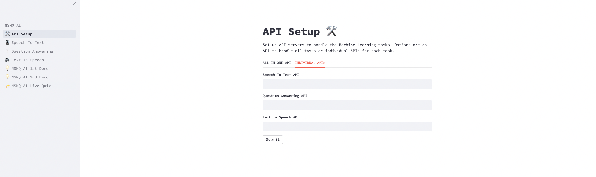

# NSMQ AI Web App Environment Setup

### Prerequites
1. Python 3 
2. PIP 

## Virtual Environment
Select an environment manager of your choice to establish your virtual environment. Here's a selection of environment managers available for you to consider:
- venv
- virtualenv
- conda

### Is your virtual environment ready? If so, execute this command in your terminal which will set up the web application.
```bash
python start_nsmqai.py
```

Now, the web application will be running and accessible through the following URL: ```http://localhost:8501/```

## API Setup 
Here is the list of APIs that must be running to access the complete functionality of the web application. Note that each of these APIs is contained within their respective notebooks, and you need to have them running:
- [Speech-to-Text API](https://github.com/nsmq-ai/nsmqai/blob/main/speech-to-text/STT_Inference_API_Server_Colab_Notebook.ipynb)
- [Text-to-Speech API](https://github.com/nsmq-ai/nsmqai/blob/main/text-to-speech/TTS_inference_API_notebook.ipynb)
- [Question-Answering API](https://github.com/nsmq-ai/nsmqai/blob/main/question-answering/QAML_Inference_API_Notebook.ipynb)


Make sure you've completed the setup process for all the ML notebooks and have them running. Once everything is configured and your scripts are active, copy the distinct public URL provided by `ngrok` for each notebook. Then, proceed to submit these URLs in the API Settings page of the web application. This will grant access to the running servers through the web app.


### API Setup Page
--- 

### Homepage

