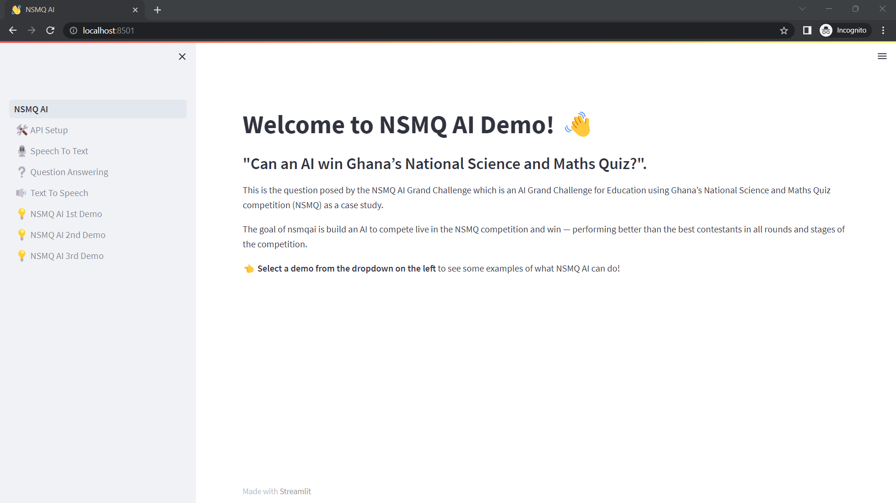

# NSMQ AI Workshop Demo

## Setup
- The demo app can be run locally. Follow steps here to setup a python environment for streamlit https://docs.streamlit.io/library/get-started/installation
- Install dependencies in the virtual python environment by running command `pip install -r requirements.txt`

## Deploy
- From the local repo directory `/nsmqai/streamlitDemo`, run command from the virtual environment terminal `streamlit run NSQM_AI.py`
- WebApp will be deployed at `http://localhost:8501/`

## Having App Issues?
- Check API URLs being used are valid and actively running
- Check that API URLs are setup on the `http://localhost:8501/API_Setup`
