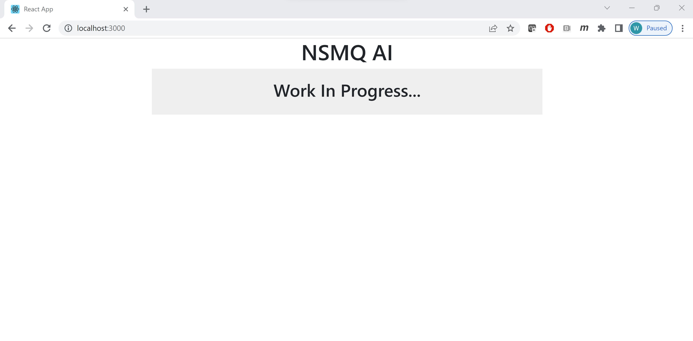

## NSMQ AI Web application

### React application with a NodeJS backend and a MongoDB database

## Deploy with docker compose

```
$ docker compose up -d
[+] Running 3/3
 - Container webapp-mongo-1     Started 2.3s
 - Container webapp-backend-1   Started 3.7s
 - Container webapp-frontend-1  Started 5.6s
```

## Expected result

Listing containers must show containers running and the port mapping as below:
```
$ docker ps
CONTAINER ID   IMAGE             COMMAND                  CREATED      STATUS              PORTS                    NAMES
3476f199761b   webapp-frontend   "docker-entrypoint.s…"   7 days ago   Up About a minute   0.0.0.0:3000->3000/tcp   webapp-frontend-1
5873c5aabfba   webapp-backend    "docker-entrypoint.s…"   7 days ago   Up About a minute   3000/tcp                 webapp-backend-1
b86d2bce1b5c   mongo:4.2.0       "docker-entrypoint.s…"   7 days ago   Up About a minute   27017/tcp                webapp-mongo-1
```

After the application starts, navigate to `http://localhost:3000` in your web browser to view the webapp.



To stop and remove the containers
```
$ docker compose down
Stopping server   ... done
Stopping frontend ... done
Stopping mongo    ... done
Removing server   ... done
Removing frontend ... done
Removing mongo    ... done
```


##
