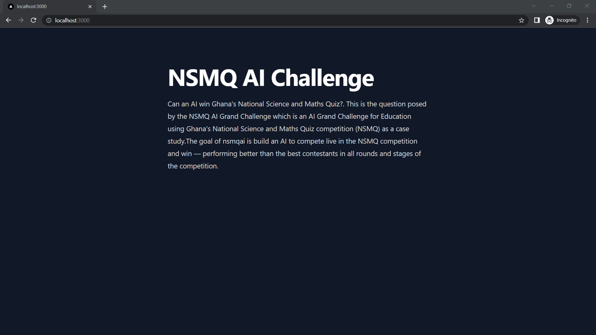

# NSMQ AI Web application

## Frontend
Front end is using NextJS. To deploy it locally, run the development server from `webapp/frontend`:

```bash
npm run dev
```

Open [http://localhost:3000](http://localhost:3000) with your browser to see the result.



You can start editing the page by modifying `webapp/frontend/pages/index.tsx`. The page auto-updates as you edit the file.

## Backend
Coming soon

## Database
Coming soon
